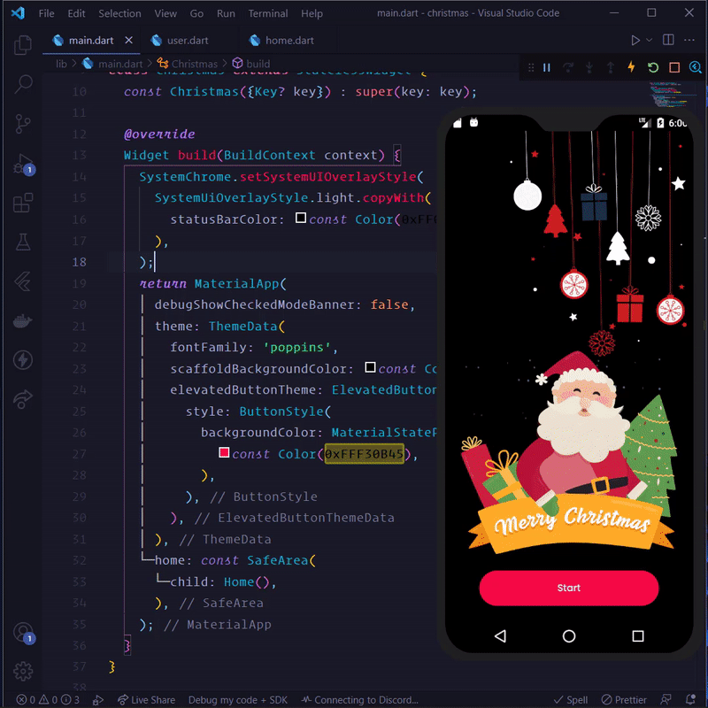

# Christmas wishing app

Wishes Merry Christmas to all my current instagram followers (6526).

If you wanna check your name in the followers list then you can find it in [users.json](./assets/data/users.json) file.



# **Tools used**

- For animation I have used `Lottie` files with flutter `lottie package`.
- `Animate_do` package for fading animation.
- `audioplayers` package for playing music.
- For users data I did `Cross Site Scripting (xss)` in instagram browser dev tools.

<hr />

⚠️ **Not Recommended** ⚠️

**Here how I scraped user data.**

> **Why did I need to scrap followers data?** <br />According to this [answer on stackoverflow ](https://stackoverflow.com/a/39876178/10285324) I came to know that instagram doesn't provide api for get list of your follower or following. <br />
> Show I thought it will be cool to use my dirty skills. 😜

> **Note:** This code works for now but in future this code may break due to dom element changes. (Current test was done on windows 11 google chrome.)

1. Open follower modal from your profile.
2. Now open dev tools and follow these steps.
3. Create `users` variable to store all users.

```js
let users = [];
```

4. Use this code to scroll your and load all followers.

> **Note:** This step may take time depending on your followers. For me it took around 1 hour.

```javascript
function scroll() {
  const container = document.querySelector(
    "body > div.RnEpo.Yx5HN > div > div > div.isgrP"
  );
  container.scrollTo(0, container.scrollHeight);
  setTimeout(() => scroll(), 4000);
}
scroll();
```

5. Once all users loaded use below code to convert it into json.

```js
document
  .querySelectorAll(
    "body > div.RnEpo.Yx5HN > div > div > div.isgrP > ul > div > li"
  )
  .forEach((li, i) => {
    const imgUrl =
      li.firstElementChild.firstElementChild.firstElementChild.firstElementChild
        .children[1].firstElementChild.src;
    const name =
      li.firstElementChild.firstElementChild.children[1].children[1].innerText;
    const username =
      li.firstElementChild.firstElementChild.children[1].firstElementChild
        .firstElementChild.innerText;
    const user = { imgUrl, name, username };
    users.push(user);
  });
```

6. Now just type `users` variable in dev console and right click and click on `copy object`.
7. Done!

> **Note:** If you wanna use this app to wish your followers then you just need to replace my `./assets/data/users.json` to yours. 🥳

# **[Android Apk](./release/app-release.apk)**

## Thankyou! ❤️
